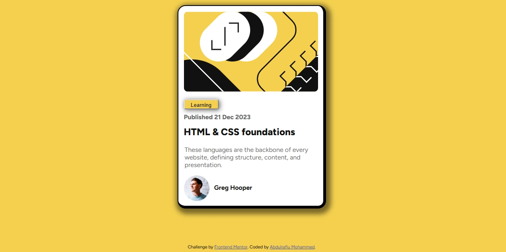

# Frontend Mentor - Blog preview card solution

This is a solution to the [Blog preview card challenge on Frontend Mentor](https://www.frontendmentor.io/challenges/blog-preview-card-ckPaj01IcS). Frontend Mentor challenges help you improve your coding skills by building realistic projects. 

## Table of contents

- [Overview](#overview)
  - [The challenge](#the-challenge)
  - [Screenshot](#screenshot)
  - [Links](#links)
- [My process](#my-process)
  - [Built with](#built-with)
  - [What I learned](#what-i-learned)
  - [Continued development](#continued-development)
  - [Useful resources](#useful-resources)
- [Author](#author)
- [Acknowledgments](#acknowledgments)

**Note: Delete this note and update the table of contents based on what sections you keep.**

## Overview

This page contains my screenshots, process, and how i built the website.

### The challenge

Users should be able to:

- See hover and focus states for all interactive elements on the page

### Screenshot




### Links

- Solution URL: [solution URL here](https://your-solution-url.com)
- Live Site URL: [live site URL here](https://your-live-site-url.com)

## My process

So i first of all started by first of all arranging the HTML syntax, so as to structure my work and make it easier for building.
Then i built the container, and aligned itself and the contents within it to the center of the page.
Then i did a building from the head down, so which means from the first picture, down to the last picture and its text.
After all those were done, i styled the border, to have like that 3d feel.

### Built with

- Semantic HTML5 markup
- CSS custom properties
- Flexbox
- CSS Grid
- SASS
- google fonts (for the fonts-family, and styles)


### What I learned

I had no idea that 'border' could be used the way it was used in this challenge, and it's same way i used it.
So i'm just very Proud of myself for being able to build and style this page.


The CSS code i'm Proud of;
```css
.proud-of-this-css {
    border: 2px solid $black;
    border-right-width: 7px;
}
```


### Continued development

So i'm just going to continue taking more frontend challenges. 
They are really helpful, engaging, and interesting!.
I really do have a nice time when i'm working on a challenge, and this one was an eye-opener to me.

### Useful resources
Honestely, i didn't have any resource to help out, i did it all on my own, and it was worth it, it made it feel more of a challenge

## Author

- Youtube - [CodeWithMe](www.youtube.com/@Rafman01)
- Frontend Mentor - [@Rafman0](https://www.frontendmentor.io/profile/Rafman0)


## Acknowledgments

Yeah i'd like to Acknowledge myself, for being me, and for always pushing forward no matter what the challenge is!.
So i'd like to say cheers to myself, and cheers to more professional coding days ahead!!.
